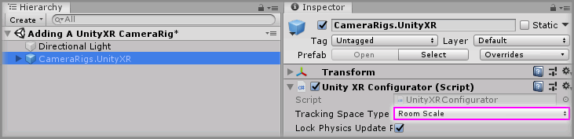

# Adding A UnityXR CameraRig

> * Level: Beginner
>
> * Reading Time: 2 minutes
>
> * Checked with: Unity 2018.3.14f1

## Introduction

The `CameraRigs.UnityXR` prefab provides a camera that tracks the HMD rotation and position along with any available XR controllers. This utilizes the underlying [Unity] provided functionality for accessing the connected hardware.

> The legacy XR management system was deprecated in Unity `2019.3.0f1`, please use the [Tilia.CameraRigs.XRPluginFramework.Unity] package for support with the new Unity XR Plugin Framework.

## Prerequisites

* [Install the Tilia.CameraRigs.UnityXR] package dependency in to your Unity project.

## Let's Start

### Step 1

Add a `CameraRigs.UnityXR` prefab to the Unity project hierarchy by selecting `GameObject -> Tilia -> Prefabs -> CameraRigs -> CameraRigs.UnityXR` from the Unity main top menu.

### Step 2

Delete the `Main Camera` GameObject from the Unity Hierarchy window as the `CameraRigs.UnityXR` prefab contains a Main Camera for the Scene.

### Step 3

Select the `CameraRigs.UnityXR` GameObject in the Unity Hierarchy window and change the `Unity XR Configurator` component to suit your Tracking Space requirements.

* Ensure the `Tracking Space Type` is set to:
  * `Room Scale` for XR devices that support 6 degrees of freedom tracking (the ability to move around your play area).
  * `Stationary` for XR devices that support 3 degrees of freedom tracking (only the ability to look around but not move within your play area).

### Done

Now you have a UnityXR CameraRig in your scene. If you play the Unity scene you will see that the game Main Camera is tracking the XR HMD and if there is a connected left and/or right XR controller then they will be tracking the Left/Right Anchors of the UnityXR CameraRig.

[Install the Tilia.CameraRigs.UnityXR]: ../Installation/README.md
[Unity]: https://unity3d.com/
[Tilia.CameraRigs.XRPluginFramework.Unity]: https://github.com/ExtendRealityLtd/Tilia.CameraRigs.XRPluginFramework.Unity